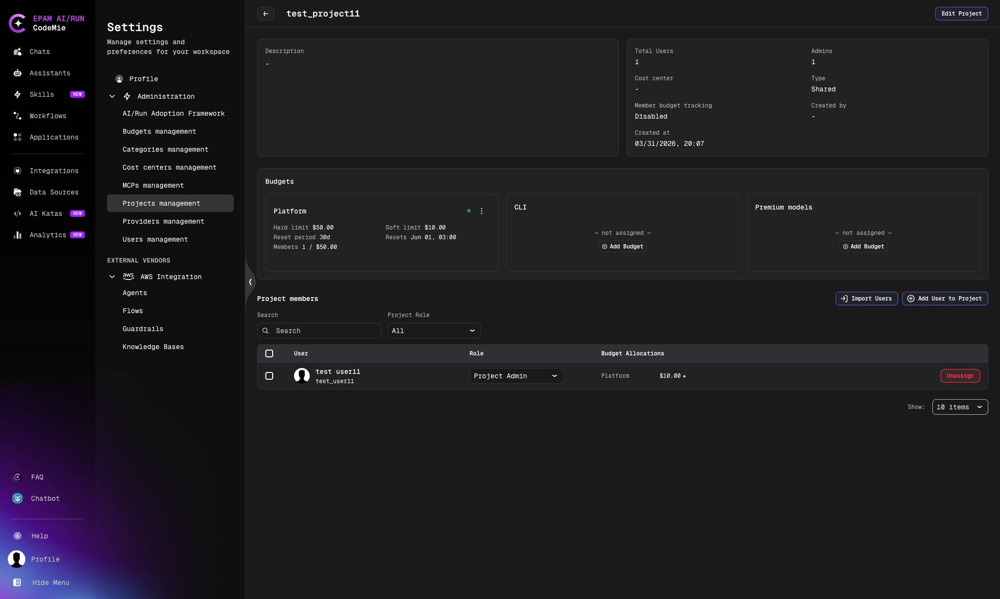
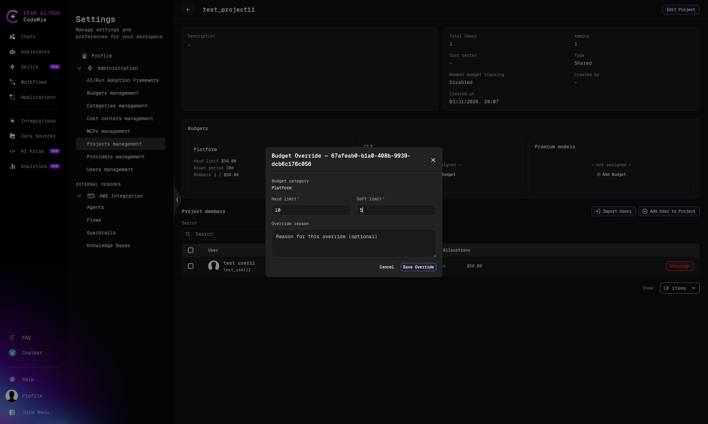
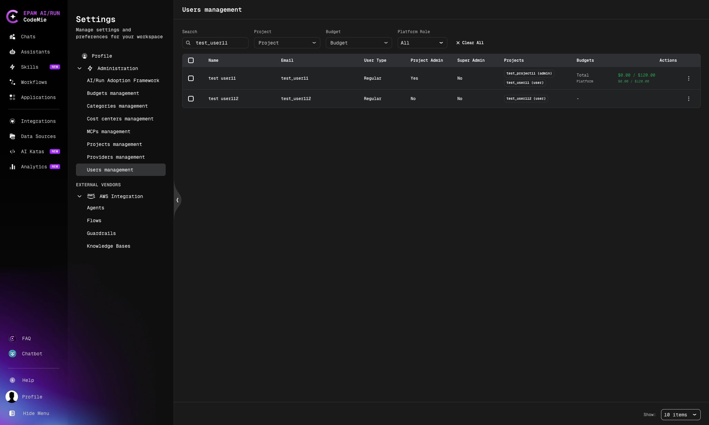

# Project Budget Management

Project budgets let platform administrators allocate a dedicated spend envelope to a specific project and [budget category](#budget-categories). When a user makes LLM requests within a project context, CodeMie enforces both the project-level cap and the per-member allocation — independently from any global or personal budgets.

## Budget Categories

Each project can have up to three independent budgets, one per category:

| Category           | Tracks                                           |
| ------------------ | ------------------------------------------------ |
| **Platform**       | Standard web and API usage                       |
| **CLI**            | CodeMie CLI-originating requests                 |
| **Premium models** | High-cost model requests (e.g., Claude Opus, o1) |

Category is resolved automatically per request. If a project budget exists for the resolved category, it takes precedence over the user's global budget.

## Access Control

| Action                                  | Super-admin | Project admin     |
| --------------------------------------- | ----------- | ----------------- |
| Create / update / delete project budget | Yes         | No                |
| View project budget for own project     | Yes         | Yes               |
| Override a member's allocation          | Yes         | Own projects only |

## Prerequisites

Before managing project budgets, ensure the following are configured:

- LiteLLM Proxy is deployed and connected to CodeMie.
- Budget enforcement is enabled. See [LiteLLM Budget Configuration](../../extensions/litellm-proxy/budget-configuration) for the required environment variables (`LLM_PROXY_BUDGET_CHECK_ENABLED`, `LLM_PROXY_BUDGET_RECONCILIATION_ENABLED`).

## Creating a Project Budget

Only super-admins can create project budgets.

### 1. Navigate to the project

1. Click your **Profile** icon in the bottom-left corner and select **Settings**.
2. Go to **Administration** → **Projects Management**.
3. Select the project you want to budget.

### 2. Add a budget

In the **Budgets** section, locate the category card (Platform, CLI, or Premium models) that shows **— not assigned —** and click **Add Budget**.

### 3. Fill in the budget form


| Field            | Required | Description                                                                                                                          |
| ---------------- | -------- | ------------------------------------------------------------------------------------------------------------------------------------ |
| **Name**         | Yes      | Human-readable label for the budget                                                                                                  |
| **Description**  | No       | Optional note on the budget's purpose                                                                                                |
| **Category**     | Yes      | `Platform`, `CLI`, or `Premium models`                                                                                               |
| **Reset period** | Yes      | How often spend counters reset (e.g., `Monthly (30d)`, `Weekly (7d)`)                                                                |
| **Soft limit**   | No       | Warning threshold in USD. Must be `≥ 0` and `≤ Hard limit`. Requests are not blocked at this threshold, but alerts can be triggered. |
| **Hard limit**   | Yes      | Enforcement cap in USD. Requests are blocked once this amount is reached. Must be `> 0`.                                             |

:::info One budget per category per project
Only one active budget per `(project, category)` combination is allowed. Attempting to create a duplicate returns a validation error.
:::

### 4. Click Create

The budget is provisioned and synchronized with LiteLLM. The category card updates to show the configured limits, reset schedule, and the number of members with allocations.

## Viewing Project Budgets and Member Allocations

After a budget is created, the project page shows up to three category cards and a **Project members** table.



Each budget card displays:

- **Hard limit** and **Soft limit** in USD
- **Reset period** and next **Resets** date/time
- **Members X / $Y.YY** — the number of members with this budget and each member's current allocation

The **Project members** table includes a **Budget Allocations** column showing each member's category and allocated amount.

## Member Budget Allocation

When a project budget is created, CodeMie automatically distributes the budget equally across all active project members at that moment.

### Equal allocation (default)

- `max_budget` and `soft_budget` are divided equally among all members using precise decimal arithmetic (9 decimal places).
- Values are rounded to the nearest cent for display and enforcement.
- If a rounding remainder exists (e.g., `$0.01` that cannot be split evenly), it is assigned to the last member determined by ascending `user_id` sort order.
- The total of all member allocations never exceeds the project budget.

New members added to the project after the budget is created receive an equal share recalculated from the remaining budget.

### Fixed allocation (override)

A specific member can be switched to fixed mode by overriding their allocation (see [Overriding a Member's Allocation](#overriding-a-members-allocation)). Fixed members keep their explicit amount; the remaining budget is re-split equally among all other (equal-mode) members.

## Overriding a Member's Allocation

Super-admins and project admins can set a custom spend limit for an individual member.

1. In the **Project members** table, click the budget allocation badge next to the member's name.
2. The **Budget Override** popup opens.



3. Set the member's **Hard limit** and **Soft limit** values.
4. Optionally enter an **Override reason** for audit purposes.
5. Click **Save Override**.

The member is switched to fixed allocation mode. Their amount is locked, and the remaining project budget is re-divided equally among all members still in equal mode.

To restore a member to equal allocation, remove their override.

## Viewing User Budget Spend (Admin)

The **Users Management** panel in Administration shows a consolidated **Budgets** column for every user.



The column shows:

- **Total** spend / total budget across all categories
- Per-category breakdown: **CLI**, **Platform**, and **Premium models**
- Format: `$spent / $limit` (a dash indicates no budget assigned for that category)

Use the **Budget** filter and **Search** field to quickly locate users by budget assignment.

## Spend Tracking

CodeMie tracks project and member spend through a background polling job that reads usage data from LiteLLM and records it in the `project_spend_tracking` table.

### How spend is calculated

On each collection run:

1. The job fetches `current_period_spend` from LiteLLM for each tracked entity (project virtual key, per-member customer record).
2. It calculates the **delta** — the difference from the previous snapshot.
3. The **daily** value equals the delta for that run.
4. The **cumulative** value accumulates across all runs and periods.

If no previous snapshot exists (first run), the current spend value is used directly as both daily and cumulative.

### Budget reset detection

LiteLLM resets a budget's spend counter when its reset period elapses. CodeMie detects this by comparing the budget's last reset timestamp against the previous snapshot date. When a reset is detected:

- The daily value reflects the new-period spend only.
- The cumulative value continues to grow — it is not cleared on reset, preserving the full historical record.

### Per-project member tracking

Member-level spend attribution is controlled by the `project_member_budget_tracking_enabled` feature flag, which can be toggled per project.

| Flag state        | Enforcement mode                      | Behavior                                                                     |
| ----------------- | ------------------------------------- | ---------------------------------------------------------------------------- |
| Enabled (default) | `PROJECT_BUDGET_WITH_MEMBER_TRACKING` | Project cap + per-member allocation both enforced                            |
| Disabled          | `PROJECT_BUDGET_PROJECT_ONLY`         | Only the project-level cap is enforced; individual member limits are ignored |

When the flag is disabled, all members share the project budget without individual caps.

:::note Spend data latency
Spend data updates on the collect schedule (nightly by default). There is typically up to a one-day lag between request completion and spend appearing in the UI.
:::

## Background Jobs and Environment Variables

Two background jobs maintain budget state. All jobs use PostgreSQL advisory locks so only one pod runs each job in a multi-replica deployment.

| Job                                                       | Purpose                                                                                                                |
| --------------------------------------------------------- | ---------------------------------------------------------------------------------------------------------------------- |
| **Spend collector** (`litellm_spend_collector`)           | Polls LiteLLM for spend data and writes deltas to `project_spend_tracking`                                             |
| **Budget reset tracker** (`litellm_budget_reset_tracker`) | Detects budget period rollovers and adjusts spend records accordingly                                                  |
| **Startup reconciliation**                                | One-time on pod start: aligns DB state with LiteLLM (predefined budgets, user assignments, project budget assignments) |

### Environment variables

| Variable                                          | Default        | Description                                                                                               |
| ------------------------------------------------- | -------------- | --------------------------------------------------------------------------------------------------------- |
| `LITELLM_SPEND_COLLECTOR_ENABLED`                 | `false`        | Enable the spend collector background job                                                                 |
| `LITELLM_SPEND_COLLECTOR_SCHEDULE`                | `0 23 * * *`   | Cron expression (UTC) for the spend collector. See [API Configuration](../api-configuration) for details. |
| `LITELLM_BUDGET_RESET_TRACKER_ENABLED`            | `false`        | Enable the budget reset tracker background job                                                            |
| `LITELLM_BUDGET_RESET_TRACKER_SCHEDULE`           | `*/10 * * * *` | Cron expression (UTC) for the reset tracker                                                               |
| `LLM_PROXY_BUDGET_RECONCILIATION_ENABLED`         | `false`        | Enable one-time startup reconciliation on pod start                                                       |
| `LLM_PROXY_BUDGET_RECONCILIATION_TIMEOUT_SECONDS` | `600`          | Timeout in seconds for the startup reconciliation job                                                     |

In the `codemie-api` Helm chart, add to the `extraEnv` list:

```yaml
extraEnv:
  - name: LITELLM_SPEND_COLLECTOR_ENABLED
    value: 'true'
  - name: LITELLM_SPEND_COLLECTOR_SCHEDULE
    value: '0 23 * * *'
  - name: LITELLM_BUDGET_RESET_TRACKER_ENABLED
    value: 'true'
  - name: LITELLM_BUDGET_RESET_TRACKER_SCHEDULE
    value: '0 0 * * *'
  - name: LLM_PROXY_BUDGET_RECONCILIATION_ENABLED
    value: 'true'
```

:::warning
Without `LITELLM_SPEND_COLLECTOR_ENABLED=true`, spend data will not be collected and budget consumption will not be visible in the UI.
:::

### AI/Run CodeMie UI

In the `codemie-ui` Helm chart `values.yaml`, set:

```yaml
viteEnableBudgetManagement: true
```

`viteEnableBudgetManagement` enables budget columns and the budget management section on
project detail pages. Set it to `false` if your deployment does not use budget tracking.

## See Also

- [LiteLLM Budget Configuration](../../extensions/litellm-proxy/budget-configuration) — predefined global budgets and enforcement flags
- [API Configuration Reference](../api-configuration) — full environment variable reference
- [Platform Administration](../platform-administration) — creating and managing projects
