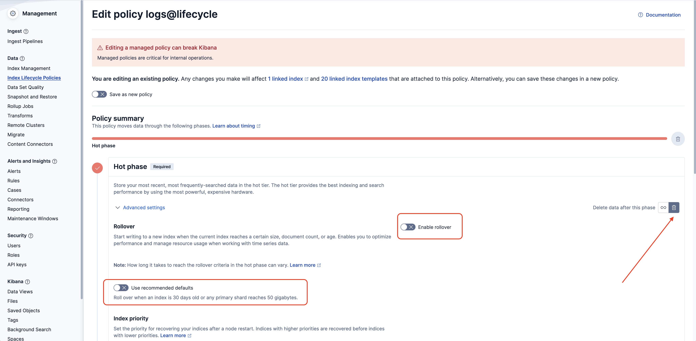
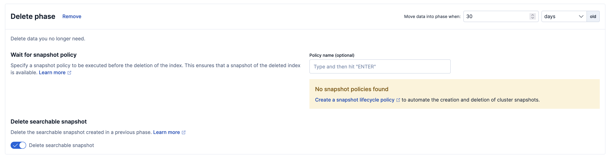

This page describes how to manage retention for the infrastructure logs aggregated in Elasticsearch to prevent unbounded disk usage.

:::warning No automatic deletion by default
The `logs-codemie-infra*` index pattern has the built-in `logs@lifecycle` ILM policy
assigned, but that policy does not include a delete phase. Logs accumulate indefinitely
until you add a delete phase to the policy.
:::

## Log Indexes

| Index                 | Data                                                        | Default ILM policy | Default deletion |
| --------------------- | ----------------------------------------------------------- | ------------------ | ---------------- |
| `logs-codemie-infra*` | Infrastructure and application logs collected by Fluent Bit | `logs@lifecycle`   | Not configured   |

To enable automatic deletion, add a delete phase to the `logs@lifecycle` policy as
described below.

---

## Configuring Retention with Index Lifecycle Management

Elasticsearch ILM automates index management through a series of phases. The
`logs-codemie-infra*` indexes already use the `logs@lifecycle` policy, but the delete
phase must be added manually to enable automatic removal.

Open the Kibana UI (**Stack Management → Index Lifecycle Policies**), find
`logs@lifecycle`, and edit it:

- Open "Advances Settings" for "Hot phase"
- Disable "Use recommended defaults"
- Disable "Enable rollover"
- Enable data deletion as shown on the screenshot below

- Scroll down to the "Delete phase" and set desired count of days to keep log records.

- Save changes

## Manual Cleanup

Earlier deployments used the `codemie_infra_logs` index pattern, which is now deprecated.
Check whether these indexes are still present and remove them if not needed:

1. Open **Stack Management → Index Management**.
2. Search for `codemie_infra_logs`.
3. If any `codemie_infra_logs-<date>` indexes exist, delete them.

:::warning
Index deletion is irreversible.
:::

---

## Related

- [Observability Overview](./index.md) — overview of the full observability stack
- [API Configuration](../codemie/api-configuration.md) — full environment variable reference
