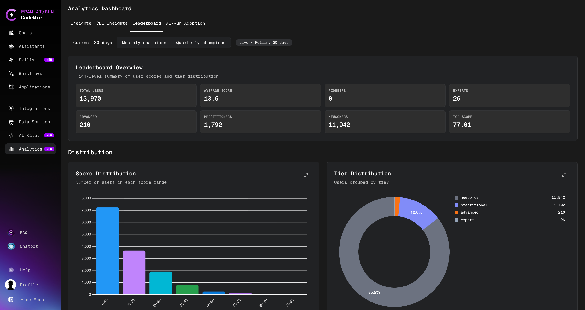

# AI Champions Leaderboard

The AI Champions Leaderboard ranks platform users by their overall AI engagement score,
calculated across six dimensions of platform activity. It gives platform admins a structured
view of AI adoption patterns and helps identify top contributors across the organization.

:::info
The full leaderboard is visible to [**platform admins**](../getting-started/glossary.md#platform-admin) only. Regular users can view their
own profile and score, but cannot see other users' rankings.
:::

## Accessing the Leaderboard

1. Click the **Analytics** icon in the left sidebar navigation.
2. Select the **Leaderboard** tab at the top of the Analytics Dashboard.

Admins see the full ranked table with filters and aggregated statistics. Regular users land
directly on their personal score card.

## Scoring Model

Each user receives a total score from **0 to 100**, calculated as a weighted sum of six
dimension scores.

| #   | Dimension                 | Weight | What it measures                                              |
| --- | ------------------------- | ------ | ------------------------------------------------------------- |
| D1  | Core Platform Usage       | 20%    | Active days, conversations, assistants used, platform breadth |
| D2  | Core Platform Creation    | 20%    | Assistants, skills, and data sources created; asset maturity  |
| D3  | Workflow Usage            | 10%    | Workflow execution volume, success rate, repeat usage         |
| D4  | Workflow Creation         | 10%    | Workflows built, structural complexity, originality           |
| D5  | CLI & Agentic Engineering | 30%    | CLI sessions, repositories, code output, delivery efficiency  |
| D6  | Impact & Knowledge        | 10%    | Asset reuse by others, knowledge sharing, kata completions    |

D5 carries the highest weight, reflecting that agentic, code-level AI usage is the most
advanced form of platform engagement.

:::note
Users with a total score of **0** are excluded from the leaderboard entirely. Only active
users appear in rankings.
:::

## Tiers

Users are assigned a tier based on their total score:

| Tier             | Min Score | Description                                         |
| ---------------- | --------- | --------------------------------------------------- |
| **Pioneer**      | 80+       | Exceptional breadth and depth across all dimensions |
| **Expert**       | 65–79     | Strong engagement across most platform areas        |
| **Advanced**     | 45–64     | Consistent usage with meaningful creation activity  |
| **Practitioner** | 25–44     | Regular platform user with growing engagement       |
| **Newcomer**     | < 25      | Early-stage user just getting started               |

## Intent Classification

In addition to a tier, each user is assigned an **intent** label that reflects their primary
usage pattern:

| Intent                 | Description                                                                |
| ---------------------- | -------------------------------------------------------------------------- |
| **SDLC Unicorn**       | Strong across platform usage, creation, workflows, and CLI engineering     |
| **Developer**          | CLI-dominant usage — primarily uses CodeMie through the command-line agent |
| **Workflow Architect** | Primarily builds and creates workflows                                     |
| **Workflow User**      | Primarily executes and consumes workflows                                  |
| **Platform Builder**   | Focused on creating assistants, skills, and data sources                   |
| **AI User**            | Primarily uses the platform through web conversations and assistants       |
| **Explorer**           | Very low overall activity; early exploration stage                         |

## Leaderboard Views

The leaderboard supports three time-based views, selectable from the view switcher at the
top of the tab:

| View                    | Description                                   |
| ----------------------- | --------------------------------------------- |
| **Current 30 days**     | Rolling 30-day window, recomputed nightly     |
| **Monthly champions**   | Final snapshot for a completed calendar month |
| **Quarterly champions** | Final snapshot for a completed quarter        |

Monthly and quarterly views are archived snapshots — they reflect the state at the end of
that period and do not change.

## Admin Capabilities

Platform admins have access to additional leaderboard functionality:

### Browsing and Filtering

The leaderboard table supports:

- **Search** by user name or email
- **Filter** by tier or intent
- **Sort** by rank, total score, username, or tier level

### User Detail View

Click any user row to open their detailed profile, which shows:

- Scores and component breakdowns for all six dimensions
- Assigned tier and intent
- Active projects

### Leaderboard Summary

The top of the Leaderboard tab displays aggregated statistics:

- Total scored users
- Average score across the organization
- User count per tier
- Top score in the current period

## Configuration

The leaderboard feature is controlled by the following environment variables, set by the
platform administrator:

| Variable                  | Default     | Description                                 |
| ------------------------- | ----------- | ------------------------------------------- |
| `LEADERBOARD_ENABLED`     | `false`     | Enables the nightly computation job         |
| `LEADERBOARD_SCHEDULE`    | `0 2 * * *` | Cron expression for the scheduled run (UTC) |
| `LEADERBOARD_PERIOD_DAYS` | `30`        | Rolling window size in days                 |

If `LEADERBOARD_ENABLED` is `false`, the leaderboard tab is not available and the nightly
job does not run. Contact your platform administrator to enable this feature.
