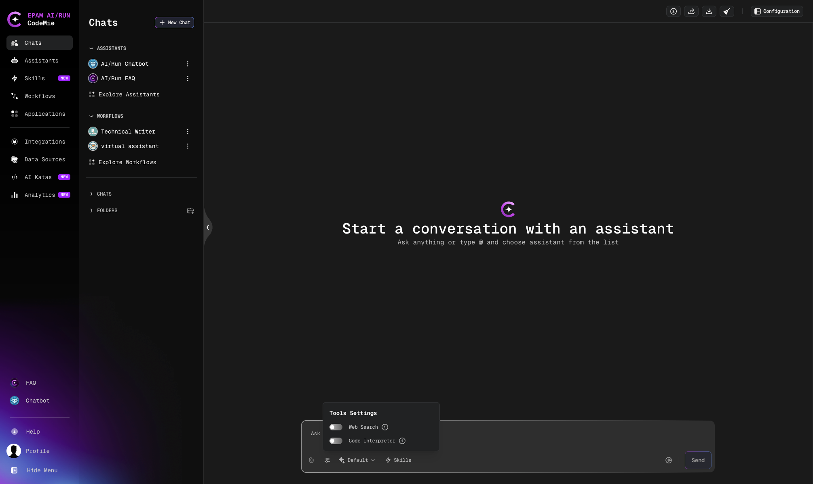

# Chat Input Settings

The chat input toolbar provides controls for customizing assistant behavior per
conversation: **file attachments**, the **Tools Settings** panel, the **LLM model
selector**, and the **Skills** button. Changes take effect immediately and apply to all
subsequent messages in the current chat.

:::note
These controls are not available in workflow chats or on shared (read-only) pages. They
are also temporarily disabled while a response is being generated.
:::

## Tools Settings

Click the **sliders icon** in the chat input toolbar to open the Tools Settings panel. The
icon shows a numeric badge indicating how many tools are currently active. The tooltip
reads: _"Configure dynamic tools for this conversation"_.

The panel contains toggles for Web Search and Code Interpreter. Each toggle is only shown
if an administrator has enabled the corresponding feature for your environment. If both
features are disabled, the sliders icon is hidden entirely.

### Web Search

Enables real-time internet search during the conversation. When active, the assistant can
search Google Search, Tavily Search, and the web to include up-to-date information in its
responses.

| State   | Behavior                                                      |
| ------- | ------------------------------------------------------------- |
| **On**  | Assistant searches the web to supplement its answers          |
| **Off** | Assistant relies only on its training data and uploaded files |

Toggle Web Search **on** when you need current information, live data, or answers about
recent events. Toggle it **off** for deterministic responses based on the assistant's
knowledge.

### Code Interpreter

Activates a Python execution environment within the conversation. When enabled, the
assistant can write and run Python code to perform calculations, analyze data, and generate
visualizations.

| State   | Behavior                                                       |
| ------- | -------------------------------------------------------------- |
| **On**  | Assistant can execute Python code and return results           |
| **Off** | Assistant describes logic in text only, without executing code |

Toggle Code Interpreter **on** for data analysis, chart generation, or numerical
calculations.

:::tip
Your Tools Settings are saved per conversation. When you return to a chat, the same
toggle state is restored automatically.
:::

## LLM Model Selector

The **model selector** button sits next to the Tools Settings icon in the chat input
toolbar. It lets you override the default LLM model for the current conversation. The
tooltip reads: _"Select LLM model for this conversation"_.

The button shows **Default** when no model override is active, or a truncated model name
when one is selected.

Clicking it opens a searchable panel with the following options:

- **Assistant Default** — clears any override and uses the model configured when the
  assistant was created
- **Recommended** — the platform's recommended default model
- All available LLM models, searchable by name

The selected model applies to all subsequent messages in the current conversation until
you change it or select **Assistant Default** to revert.

## File Attachments

The **paperclip icon** in the chat input toolbar lets you attach files to your message.
Uploaded files remain accessible throughout the conversation and can be referenced in
subsequent messages without re-uploading.

See [Supported File Formats](./supported-file-formats-and-csv-handling-in-chat-assistant)
for the full list of supported formats, size limits, and CSV handling capabilities.

## Skills

The **Skills** button (lightning bolt icon, labelled **Skills**) lets you attach additional
skills to the current conversation without modifying the assistant's configuration. A badge
on the button shows how many skills are currently active.

See [Skills in Chat](../skills/skills-in-chat) for full details on selecting, managing,
and removing skills from a conversation.
