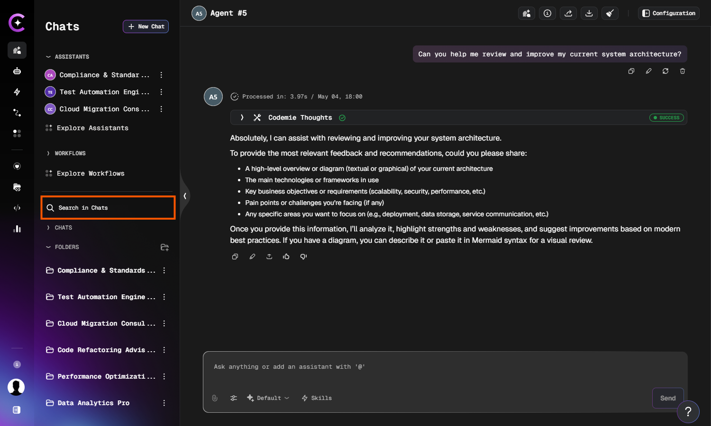
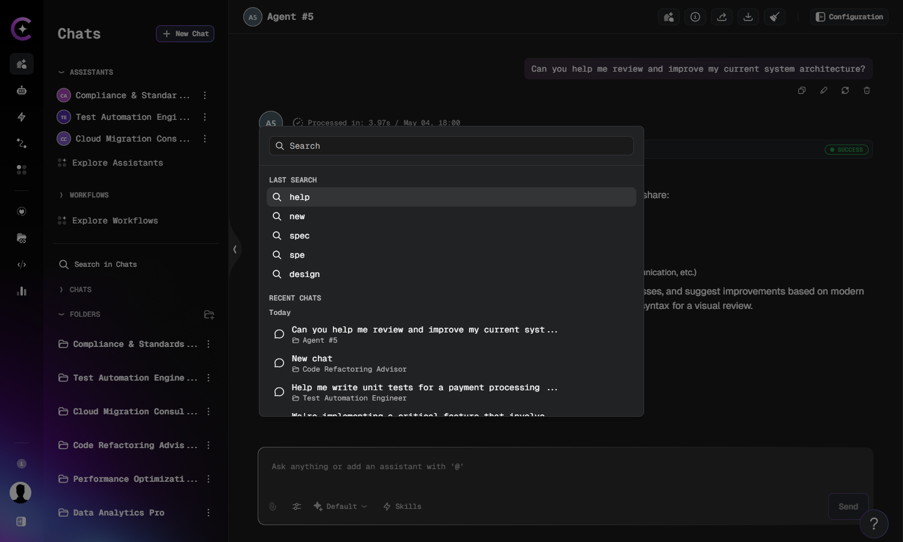

# Search in Chats

The **Search in Chats** panel lets you quickly find chats and folders by name, without
scrolling through your entire history. It opens as an overlay and provides both a search
input and a view of your recent activity.

## Open the Search Panel

Click the **Search in Chats** button in the left sidebar, below the Explore shortcuts.

The panel opens as an overlay showing your search history (if any) and your most recent chats.

## Browse Recent Chats

When the panel opens with no query entered, it shows two sections:

- **Last Search** — your previously searched terms. Click any item to restore that query instantly.
- **Recent Chats** — your latest conversations grouped by time period. Click any chat to open it.

## Search for Chats and Folders

Type at least **3 characters** into the search field to trigger a search. The panel matches
by chat name or folder name and updates results as you type.

Results are grouped and can include:

- **Chats** — matched by title. Clicking a result opens the chat and scrolls to it in the sidebar.
- **Folders** — matched by partial name. Clicking a result expands that folder in the sidebar.

If no matches are found, the panel displays **No chats or folders found**.

## Clear a Search

Click the **×** button on the right side of the search field to clear the current query and
return to the recent chats view.
