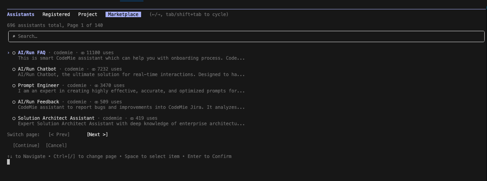
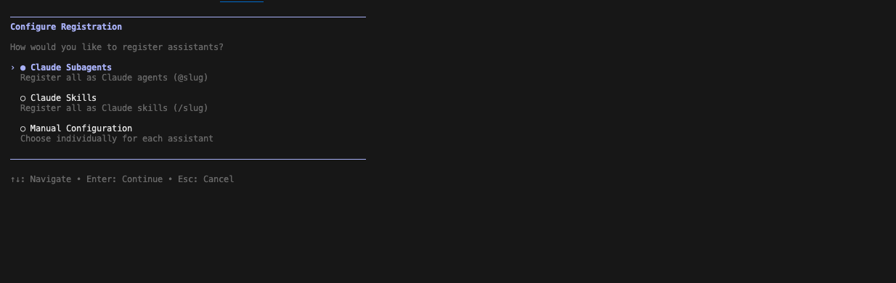
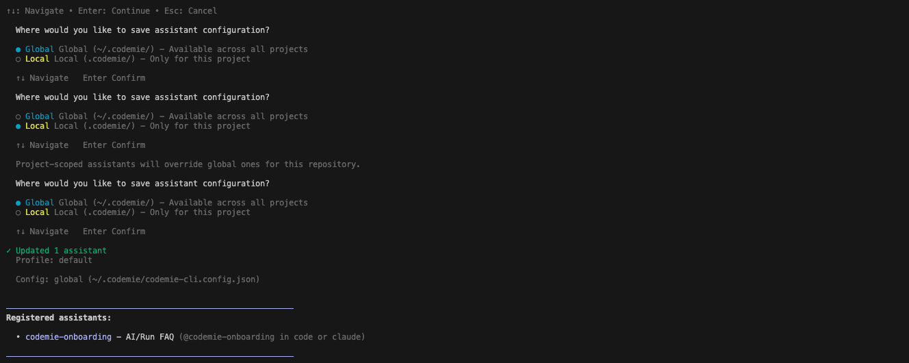
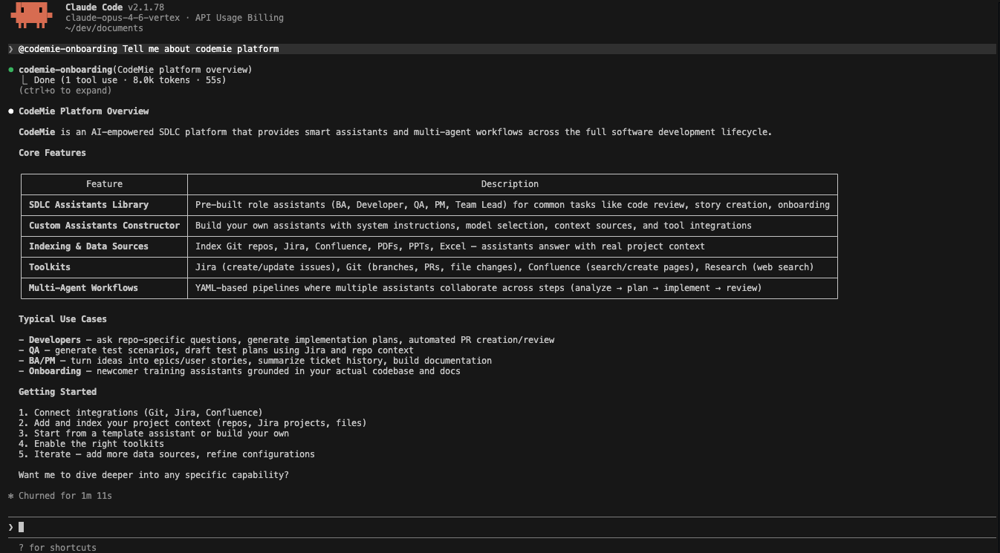

import EnterpriseFeature from '@site/src/components/EnterpriseFeature';

# Access CodeMie Assistants from CLI

<EnterpriseFeature />

CodeMie CLI lets you connect any CodeMie assistant to Claude Code so you can call it directly
from your coding session. You can also chat with assistants from the terminal at any time using
`codemie assistants chat`.

## Prerequisites

- CodeMie CLI installed and configured (`codemie setup` completed)

## Step 1: Register Assistants

Run the setup wizard to select which assistants you want to use:

```bash
codemie setup assistants
```

The wizard walks you through three steps.

### Select Assistants

A selection screen lists all assistants available to you across three tabs:

- **Registered** — assistants you have already set up
- **Project** — assistants shared within your project
- **Marketplace** — assistants available from the marketplace

Use `←`/`→` to switch between tabs, `↑`/`↓` to move through the list, `Space` to select or
deselect, and `Enter` to confirm.



### Choose Registration Mode

After selecting assistants, choose how they will appear in Claude Code:



| Mode                     | How to call it in Claude Code   | Best for                                       |
| ------------------------ | ------------------------------- | ---------------------------------------------- |
| **Claude Subagents**     | Type `@name` in the chat        | Delegation, complex multi-step tasks           |
| **Claude Skills**        | Type `/name` as a slash command | Quick, focused single-turn tasks               |
| **Manual Configuration** | Mix of the two modes above      | When different assistants need different modes |

Use `↑`/`↓` to navigate, `Enter` to confirm.

### Choose Scope

Select where to save the configuration:



| Scope      | Saved to                             | Use when                                       |
| ---------- | ------------------------------------ | ---------------------------------------------- |
| **Global** | `~/.codemie/codemie-cli.config.json` | Assistants should be available in all projects |
| **Local**  | `./.codemie/codemie-cli.config.json` | Assistants are specific to this repository     |

Local configuration overrides global for the current directory.

After confirming, the CLI sets up the assistants and shows a summary:

```
✓ Updated 1 assistant
  Registered: 1
  Unregistered: 0
  Profile: default
  Config: global (~/.codemie/codemie-cli.config.json)

Registered assistants:
  • codemie-onboarding — CodeMie Onboarding (@codemie-onboarding in code or claude)
```

## Step 2: Use Assistants in Claude Code

Once registered, launch Claude Code as usual:

```bash
codemie-claude
```

Then call your CodeMie assistant by typing `@` followed by its name in the chat:

```
@codemie-onboarding What data sources does CodeMie support?
```

Claude Code sends the request to the CodeMie assistant and returns the response.
Any files you have shared in the current Claude Code session (images, documents) are automatically
forwarded to the assistant as well.



:::tip
Not sure of the assistant's name? Re-run `codemie setup assistants` and check the **Registered**
tab, or run `codemie assistants chat` without arguments to see the full list.
:::

## Step 3: Chat from the Terminal

You can also talk to assistants directly from the terminal without opening Claude Code.

### Interactive Mode

Run without arguments to pick an assistant and start a conversation:

```bash
codemie assistants chat
```

The CLI prompts you to select an assistant, then opens a chat loop:

```
💬 Chat with CodeMie Onboarding
Type your message and press Enter. Type "/exit" or "/quit" to end the conversation.

> What is CodeMie?
[Assistant @codemie-onboarding] CodeMie is an AI-powered platform that streamlines
the full Software Development Life Cycle (SDLC)...

> /exit
```

Conversation history is preserved across sessions in `~/.codemie/sessions/`.

### Single-Message Mode

Pass the assistant ID and message as arguments to get a single response without an interactive session:

```bash
codemie assistants chat "<assistant-id>" "What data sources does CodeMie support?"
```

Only the assistant's response is printed — useful in scripts or when called from other tools.

**Options:**

| Flag                     | Description                                            |
| ------------------------ | ------------------------------------------------------ |
| `--conversation-id <id>` | Continue a specific previous conversation              |
| `--load-history`         | Load history from previous sessions (default: enabled) |
| `-f, --file <path>`      | Attach a file (can be specified multiple times)        |
| `--profile <name>`       | Use a specific CLI profile                             |
| `-v, --verbose`          | Enable debug output                                    |

## Managing Registered Assistants

Re-run `codemie setup assistants` at any time to add, remove, or reconfigure assistants.
To remove an assistant, open the wizard again and uncheck it — this removes it from the list and cleans up its configuration files.

To show only assistants from a specific project:

```bash
codemie setup assistants --project "My Project"
```

To show assistants from all projects at once:

```bash
codemie setup assistants --all-projects
```
