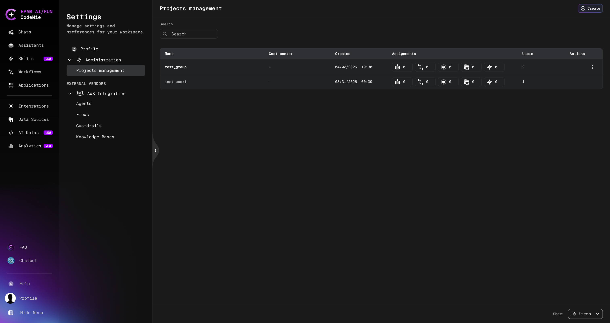
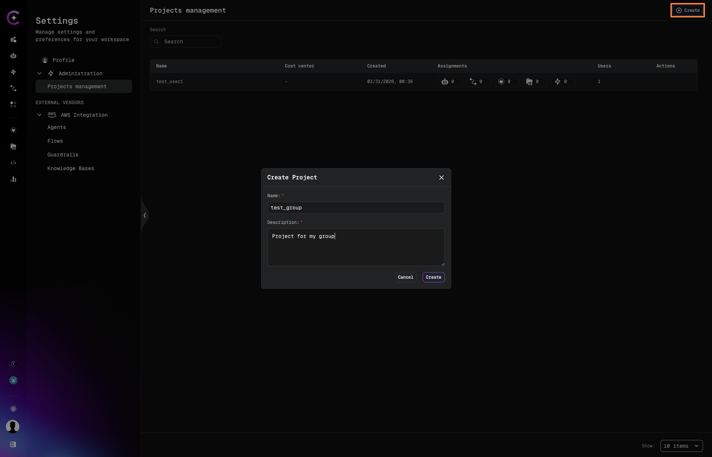
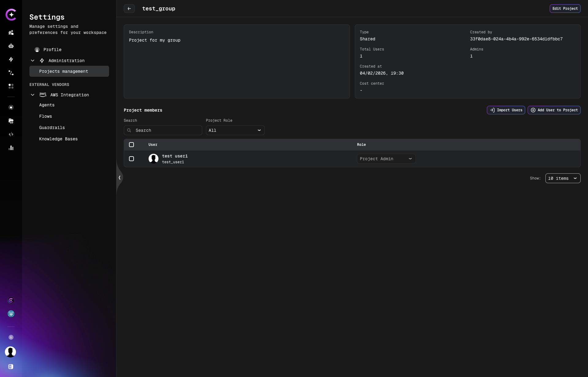
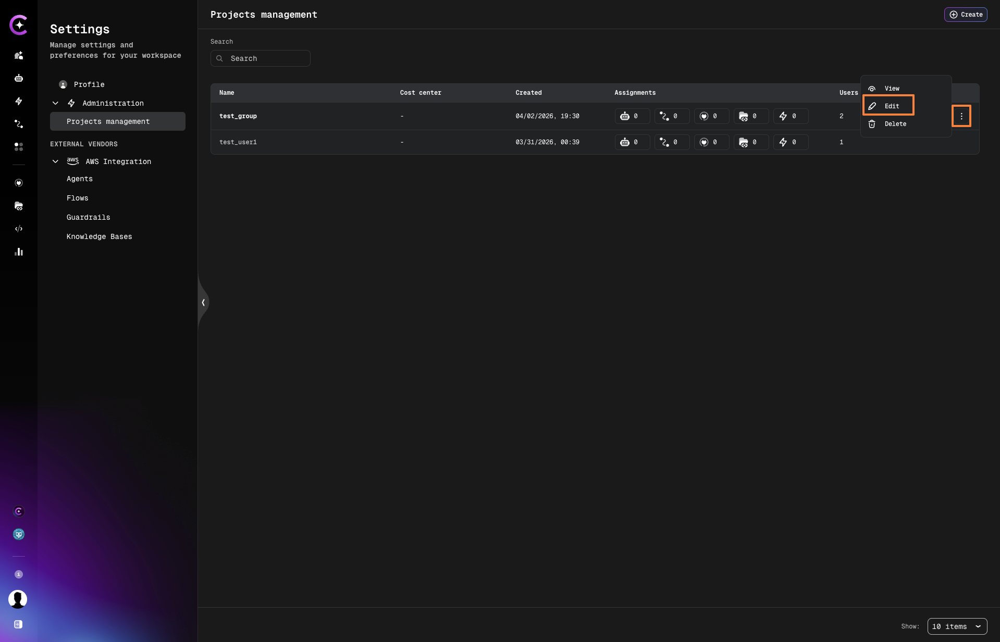
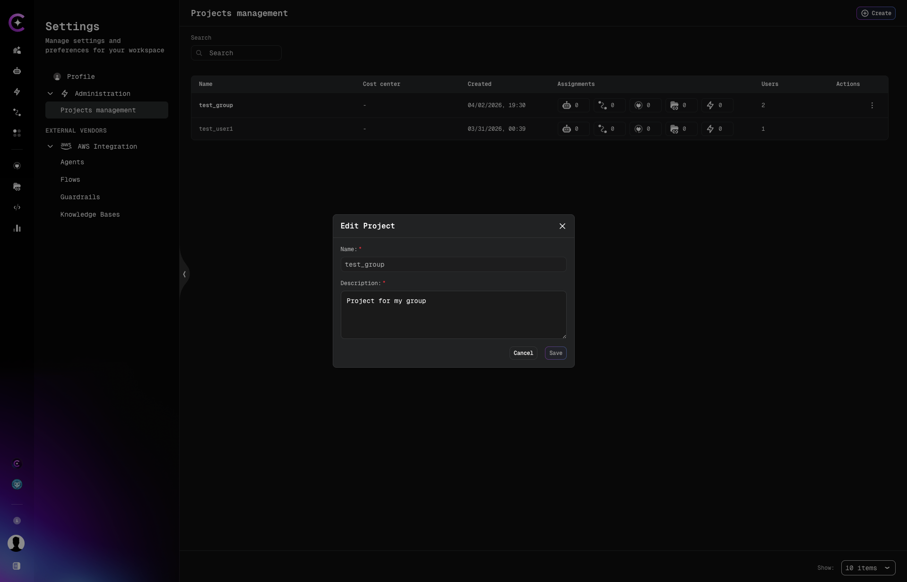
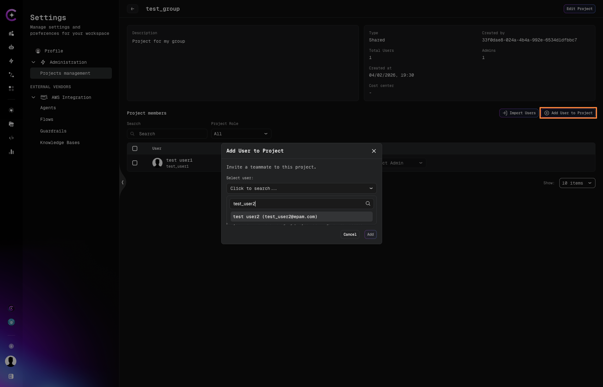
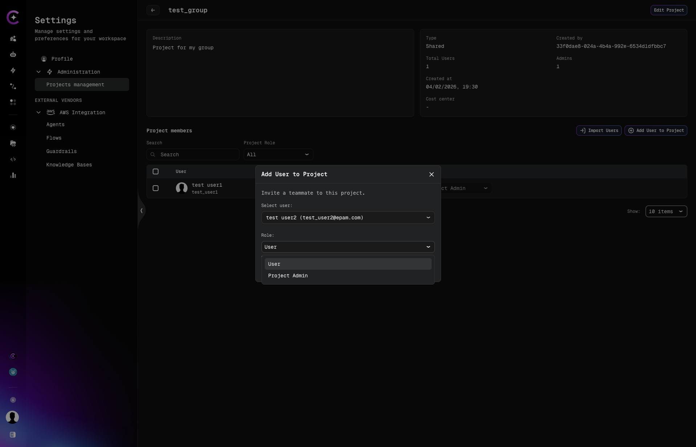
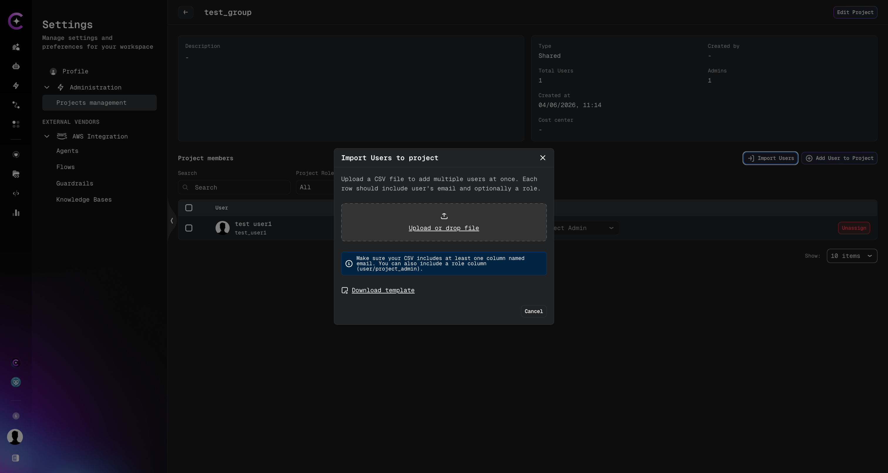
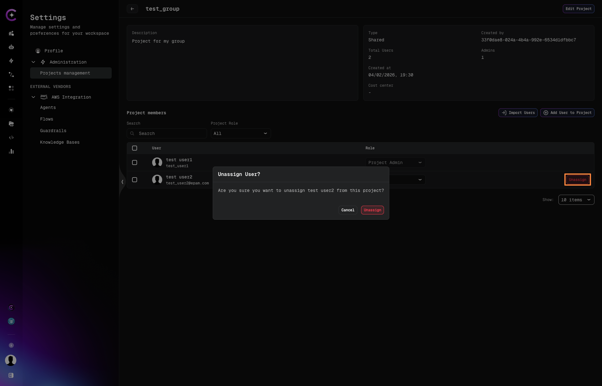

# Projects Management

Projects are isolated workspaces that group your assistants, workflows, data sources, and
integrations. Every user can create their own projects and manage team membership within them.
Platform Admins can view and manage all projects across the platform.

To access Projects Management, click the **Profile** icon in the bottom-left corner → **Settings → Administration → Projects management**.

:::info Admin configuration required
Projects Management is only available when **Platform-managed mode** is enabled. If the
**Projects management** tab is not visible, ask your administrator to follow the
[Platform-managed Mode Configuration](../../admin/configuration/access-control/platform-managed-mode-configuration.md)
guide.
:::

## Projects List

The projects list displays all projects you have access to. For each project, the table shows:

- **Name** — the project name (always lowercase)
- **Last update** — date and time of the most recent change
- **Created** — date the project was created
- **Assignments** — entity counts for linked items (users, assistants, workflows, data sources,
  and other resources), shown as icons with numbers
- **Users** — total number of members in the project
- **Actions** — row-level actions: **View**, **Edit**, and **Delete**



## Create a Project

1. Click the **Create** button in the top-right corner of the Projects Management page.
2. In the **Create Project** dialog, fill in:
   - **Name** (required) — a unique project name. Must be **lowercase only**.
   - **Description** (required) — a plain-text description of the project.
3. Click **Create**.

The new project appears in the list immediately without a page reload.



:::note
Project names must be **lowercase**. Uppercase characters are not accepted.
:::

## Open a Project

Click the **⋮ (Actions)** menu on any project row and select **View**, or click directly on
the project name. This opens the **project detail page**.

The project detail page shows:

- Project **description**, **type**, **created by**, and timestamps
- **Total users** count and **last access** date
- The **Project Members** table listing all team members and their roles



## Edit a Project

1. Click the **⋮ (Actions)** menu on a project row and select **Edit**.



2. In the **Edit Project** dialog, update the **Description**.
3. Click **Save**.

:::note
The project **name cannot be changed** after creation. If you need a different name, delete
the project and create a new one with the desired name.
:::



## Delete a Project

:::warning
A project can only be deleted if it contains **no associated entities** (no users, assistants,
workflows, data sources, or other items). If the project is not empty, deletion will be blocked
and an error will list the blocking entities.
:::

1. Click the **⋮ (Actions)** menu on the project row and select **Delete**.
2. Confirm the deletion.

The project is removed from the list immediately.

## Managing Project Members

From the **project detail page**, you can add, import, change roles for, and remove members.

### Add a User

1. Click **Add User to Project** on the project detail page.
2. In the **Select user** field, search for a user by name or email.
3. Select the user from the dropdown.



4. In the **Role** dropdown, choose the role to assign:
   - **User** — standard project access
   - **Project Admin** — can manage project members and settings



5. Click **Add**.

The user appears in the Project Members table immediately.

:::info User not found in search?
If a user does not appear in the search results, they have not logged in to CodeMie yet.
Ask them to sign in first — their account will be available in the search after their first login.
:::

### Import Users via CSV

To add multiple users at once:

1. Click **Import Users** on the project detail page.
2. In the **Import Users to project** dialog, upload a CSV file by clicking
   **Upload or drop file**, or drag and drop a file onto the upload area.

   Use the **Download template** link to get a correctly formatted file.

3. Click **Import**.



:::info CSV format
The file must have two columns:

| Column  | Required | Values                    |
| ------- | -------- | ------------------------- |
| `email` | Yes      | User's email address      |
| `role`  | Yes      | `project_admin` or `user` |

Example:

```csv
email,role
example@domain.com,project_admin
example2@domain.com,user
```

Each row represents one user to be added to the project.
:::

### Change a Member's Role

In the **Project Members** table, use the **Role** dropdown next to a user's name to switch
their role between **User** and **Project Admin**. The change takes effect immediately.

### Remove a Member

1. In the **Project Members** table, click the **Unassign** button (or the action icon) next
   to the member you want to remove.
2. Confirm the action in the **Unassign User?** dialog by clicking **Unassign**.



The user is removed from the project immediately. Their account is not deleted — they simply
lose access to this project.
