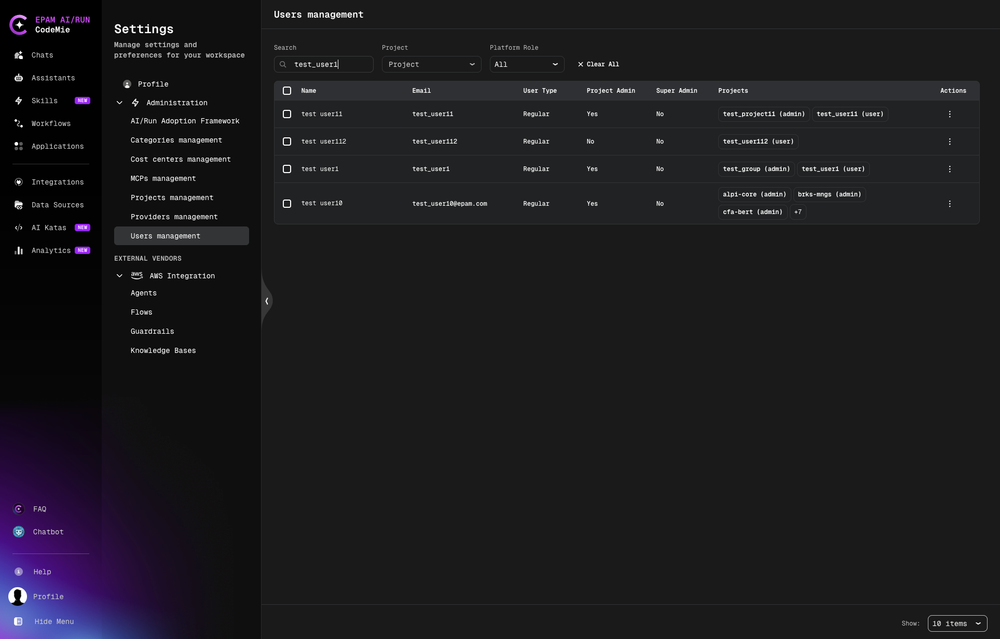
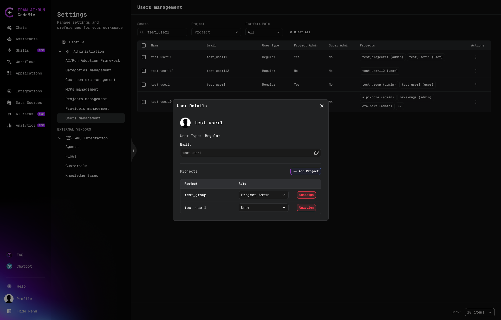
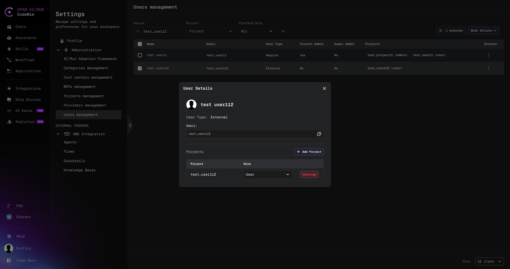

# Users Management

:::info Platform Admin only
The Users Management page is only accessible to **Platform Admins**. Regular users can manage
members within their own projects from the [Projects Management](./projects) page.
:::

The Users Management page gives Platform Admins a unified view of all users registered on the
platform, their roles, and their project memberships. From here you can filter users, inspect
individual user details, and manage project assignments.

To access Users Management, click the **Profile** icon in the bottom-left corner → **Settings → Administration → Users management**.

## Users List

The users list displays all platform users in a searchable, filterable table.

### Columns

| Column            | Description                                                                                                   |
| ----------------- | ------------------------------------------------------------------------------------------------------------- |
| **Name**          | Display name                                                                                                  |
| **Email**         | User's email address                                                                                          |
| **User Type**     | `Regular` or `External` — see [External User](../getting-started/glossary#external-user-availableforexternal) |
| **Project Admin** | Whether the user holds Project Admin role in any project                                                      |
| **Super Admin**   | Whether the user has platform-wide Super Admin privileges                                                     |
| **Projects**      | Badge list of projects the user is assigned to                                                                |
| **Actions**       | Row-level actions (edit, view details)                                                                        |

### Filtering

Use the filter bar at the top of the list to narrow results:

- **Search** — filter by name
- **Project** — show only users assigned to a specific project
- **Platform Role** — filter by `User`, `Project Admin`, or `Super Admin`

Click **Clear All** to reset all active filters.

## User Details

Click the **⋮ (Actions)** menu on a user row, or click the user's name, to open the
**User Details** panel.

The panel shows:

- **Avatar** and display name
- **User Type**: `Regular` or `External`
- **Email**: user's email address
- **Projects** table — list of projects the user is assigned to, with their role in each

## Manage a User's Project Assignments

From the **User Details** panel you can add or remove project memberships without leaving
the user record.

### Add a Project Assignment

1. In the **User Details** panel, click **Add Project**.
2. Select a project from the dropdown.
3. Choose the role: **User** or **Project Admin**.
4. Click **Add**.

The new assignment appears in the **Projects** table immediately.

### Remove a Project Assignment

1. In the **User Details** panel, locate the project in the **Projects** table.
2. Click **Unassign** next to that project.
3. Confirm the removal.

The user loses access to that project immediately. Their account is not affected.
