import Tabs from '@theme/Tabs';
import TabItem from '@theme/TabItem';

# Confluence

CodeMie integrates with Atlassian Confluence to allow assistants to retrieve and interact with your Confluence spaces, pages, and articles. This enables AI-powered search and summarization of your team's knowledge base directly from the chat.

## 1. Create API Token

<Tabs groupId="confluence-version">
  <TabItem value="cloud" label="Confluence Cloud" default>

1.1. Click your profile icon in the top-right corner and select **Account settings**:

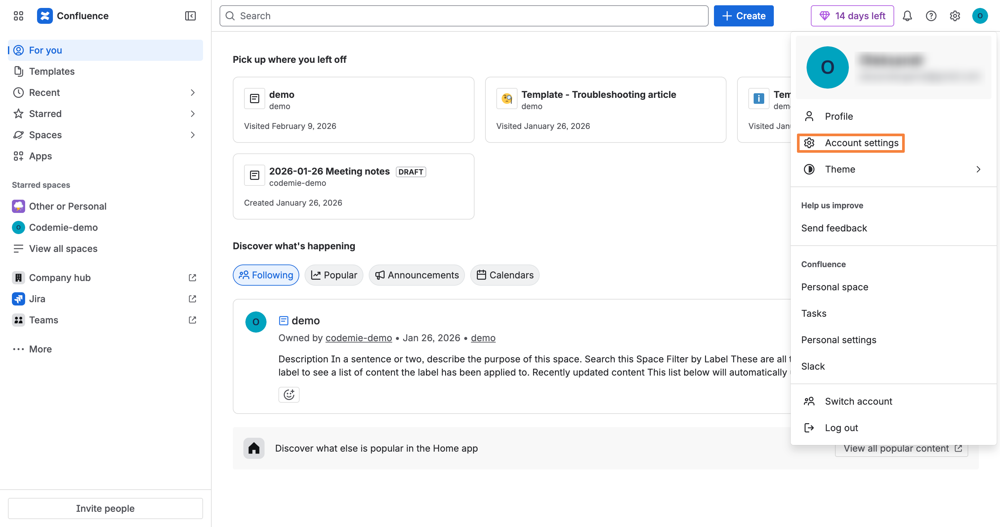

1.2. Navigate to the **Security** tab. In the **API Tokens** section, click **Create API token**:

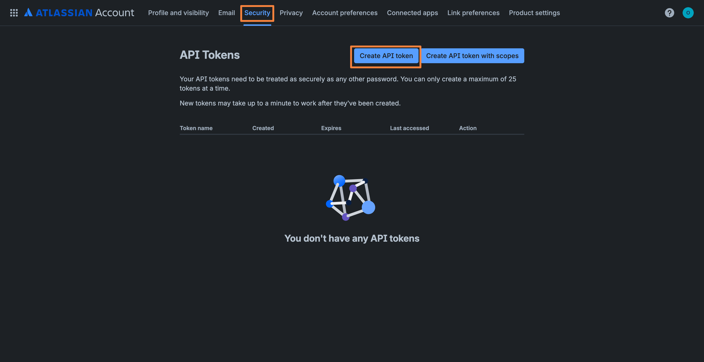

1.3. Specify a token name (e.g., "codemie-demo"), set an expiration date, and click **Create**:

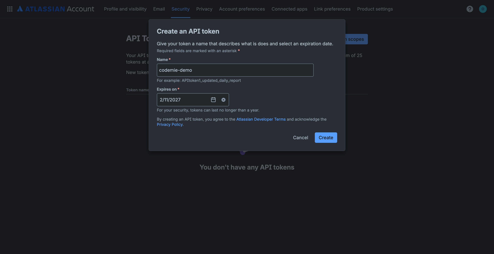

1.4. Click **Copy** to copy the generated API token and store it securely:

:::warning
You can't recover the API token after you close this dialog. Make sure to copy and save it before clicking **Done**.
:::

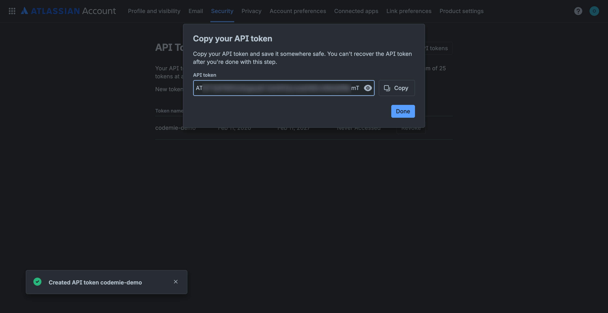

  </TabItem>
  <TabItem value="self-hosted" label="Confluence Self-hosted">

1.1. Log in to your Confluence instance. Click your profile icon in the top-right corner and select **API Token Authentication**:

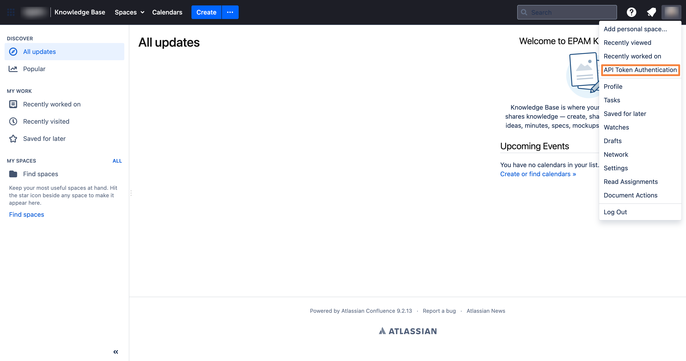

1.2. On the **My API Tokens** page, click **New API Token**:

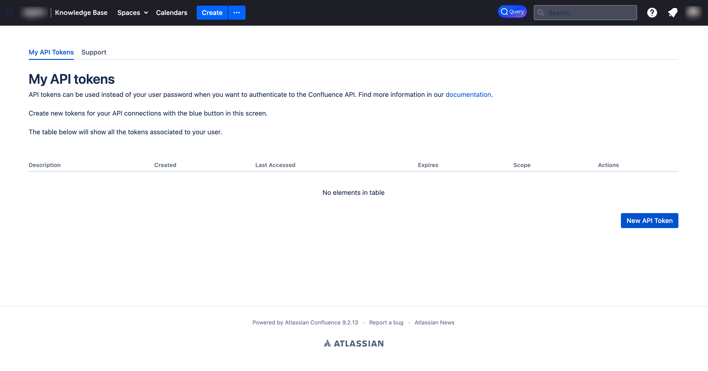

1.3. Fill in the token details and click **Create API Token**:

- **API Token Description**: Enter a descriptive name for your token (e.g., "API Token from 2026-02-11").
- **API Token Expiration**: Select expiration period (e.g., "6 months").
- **Token Scope**: Choose **Read & Write** for full access.

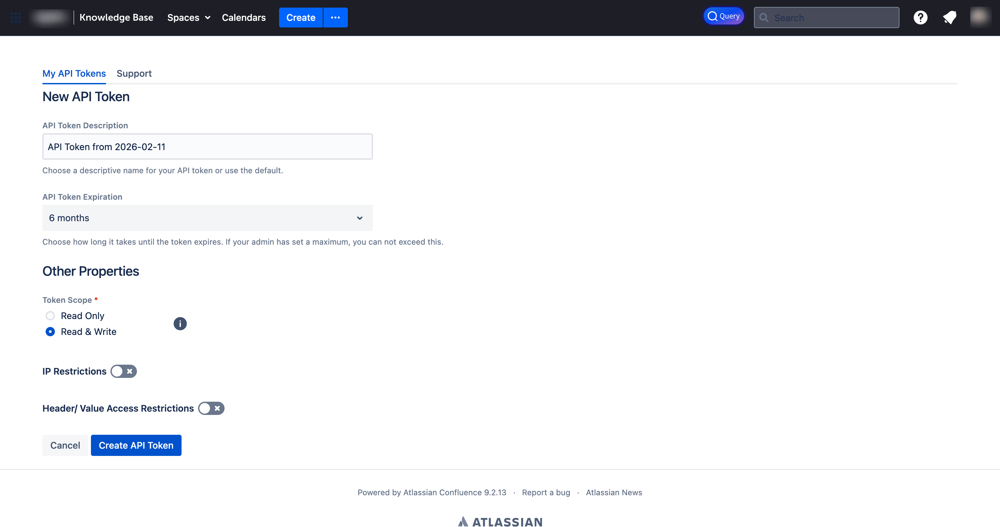

1.4. Copy the generated token and store it securely:

:::warning
You won't be able to see your token once you leave this screen. Make sure to copy and save it.
:::

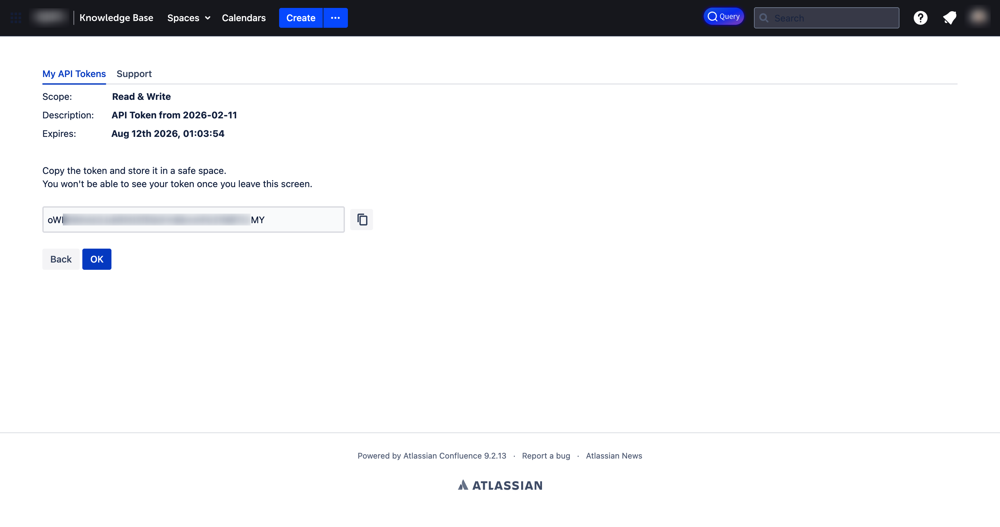

  </TabItem>
</Tabs>

## 2. Configure Integration in CodeMie

2.1. In the CodeMie main menu, click **Integrations**, select **User** or **Project** tab, and click **+ Create**.

2.2. Specify the integration parameters and click **+ Save**:

- **Project**: Select your CodeMie project name.
- **Global Integration**: Toggle on to use across multiple projects. If disabled, the integration will only be available within the selected project, and assistants and workflows attached to other projects will not be able to use it.
- **Credential Type**: Confluence
- **Alias**: Enter integration name (e.g., "codemie-demo").
- **URL**: Your Confluence instance URL:
  - For Confluence Cloud: `https://your-domain.atlassian.net`
  - For Confluence Self-hosted: your own Confluence server URL (e.g., `https://confluence.example.com`)
- **Is Confluence Cloud**:
  - ✅ **Check this box** if you're using **Confluence Cloud**
  - ❌ **Leave unchecked** if you're using **Confluence Self-hosted**
- **Username/email for Confluence**: Your Atlassian account email (e.g., `user@example.com`).
- **Token/ApiKey**: Paste the API token copied in step 1.4.

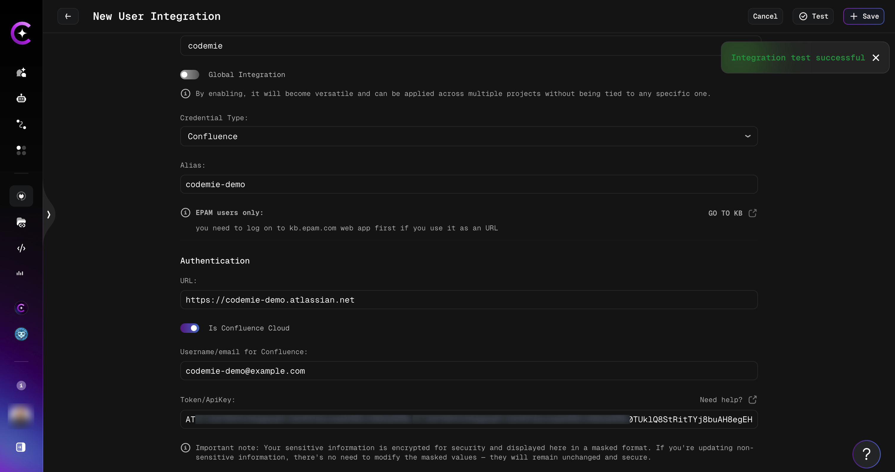

:::tip
You can click the **Test** button to verify the connection before saving. You should see an "Integration test successful" notification if the parameters are correct.
:::

:::info
If you create this integration under the **Project** tab, the key will be available to the entire project by default, meaning all project members can use it.
:::

## 3. Create Assistant with Confluence Tool

3.1. Click **Explore Assistant**, then click **Create Assistant** or edit an existing one.

3.2. In the assistant settings, expand the **Project Management** section under available tools, check **Generic Confluence**, and select your Confluence integration alias from the dropdown:

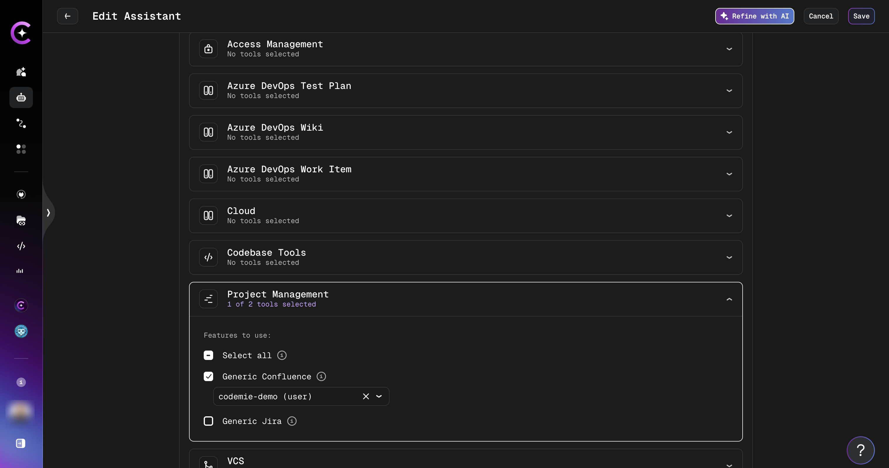

3.3. Click **Create** or **Save** to finalize your assistant.

## 4. Use Your Assistant

4.1. Select your assistant and start a conversation. You can interact with your Confluence data using natural language, for example:

- "Get me some article from Confluence"
- "Find all pages in the codemie-demo space"
- "Summarize the Getting Started page from Confluence"

The assistant will retrieve articles from your Confluence spaces and present them with space names and direct links:

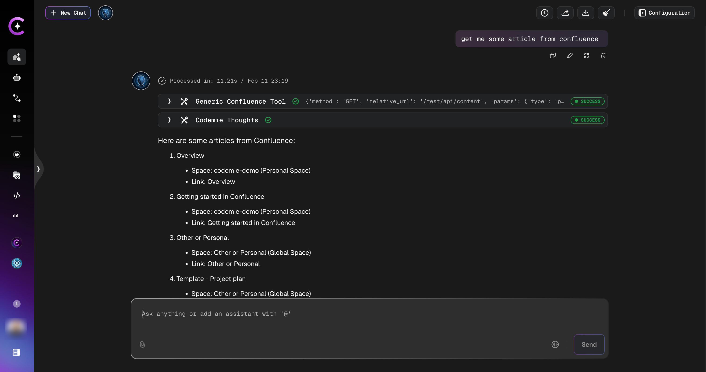
