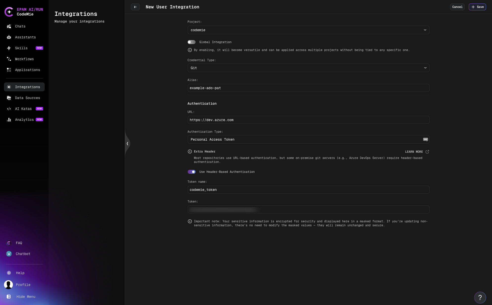

# Git AzureDevops

CodeMie supports two authentication methods for Azure DevOps Git repositories depending on
your deployment type:

| Method                  | When to use                                    |
| ----------------------- | ---------------------------------------------- |
| **URL-based** (default) | Azure DevOps Services (cloud, `dev.azure.com`) |
| **Header-based**        | Azure DevOps Server (on-premises)              |

To integrate the Azure DevOps Git tool in CodeMie, follow the steps below.

## 1. Generate Access Token for Azure DevOps GIT

### 1.1 Navigate to Personal Access Tokens

Log in to your Azure DevOps account:

- **Cloud**: `https://dev.azure.com/{your-organization}`
- **On-premises**: `https://{server}/{collection}`

Then:

- Click on your **settings icon** in the top-right corner
- Click **Personal Access Tokens**

- In the right sidebar, navigate to **Security → Personal Access Tokens**

### 1.2 Create New Token

Click the **+ New Token** button. Fill in the token creation form:

- **Name**: Enter a descriptive name (e.g., "CodeMie Integration Token")
- **Organization**: Select your organization from the dropdown
- **Expiration (UTC)**: Set expiration date
- **Scopes**: Select **Code (Read & Write)** for Git repository access
- Click the **Create** button

- **IMPORTANT**: Immediately copy the generated token from the success dialog

- Store the token securely — it will not be displayed again

:::tip
For full details on PAT creation and management, see the
[official Microsoft documentation](https://learn.microsoft.com/en-us/azure/devops/organizations/accounts/use-personal-access-tokens-to-authenticate?view=azure-devops-server).
:::

## 2. Configure Integration in CodeMie

- In the CodeMie main menu, click the **Integrations** button.
- Select Integration Type: **User** or **Project** and click **+ Create**.
- Select the Project Name.
- Select the Credential Type: **Git**.
- Fill in the **Alias** field — a label to identify this integration.
- Select **Personal Access Token** as the **Authentication Type**.

### Option A: Azure DevOps Services (cloud)

Use this option if your repositories are hosted on `dev.azure.com`.

- Fill in the **URL** field: `https://dev.azure.com`
- Fill in the **Token name** field (e.g., `oauth2`).
- Fill in the **Token** field with the token created at step 1.
- Click **+ Create**.

### Option B: Azure DevOps Server (on-premises)

Use this option if your repositories are hosted on your own infrastructure (Azure DevOps
Server, formerly TFS). On-premises installations typically reject URL-embedded credentials
and require the token to be sent via an HTTP Authorization header instead.

- Fill in the **URL** field with your server address: `https://{server}/{collection}`

When **Authentication Type** is set to **Personal Access Token**, an **Extra Header** info
block appears in the form:

> Most repositories use URL-based authentication, but some on-premise git servers
> (e.g., Azure DevOps Server) require header-based authentication.

- Enable the **Use Header-Based Authentication** toggle.
- Fill in the **Token** field with the token created at step 1.

:::note
When **Use Header-Based Authentication** is enabled, the **Token Name** field is not used
— you may leave it blank, it will be ignored.
:::

- Click **+ Create**.

:::info
When **Use Header-Based Authentication** is enabled, CodeMie encodes your token using
Base64 and sends it via the `Authorization: Basic` HTTP header during the git clone
operation. The token is never embedded in the repository URL.
:::

## 3. Create Assistant

- Click **Explore Assistant**, select **Templates** and choose for example [Template] Coder.
- Select your Project and type Name and Datasource Context.
- In the **Available tools** section, select **Git** integration and choose your credentials from the dropdown list.
- Click **Create**.

## 4. Use Your Assistant

Click **Explore Assistant**, select **My Assistant** and choose by **Name** your assistant.

:::note
Tokens have an expiration date.
:::
