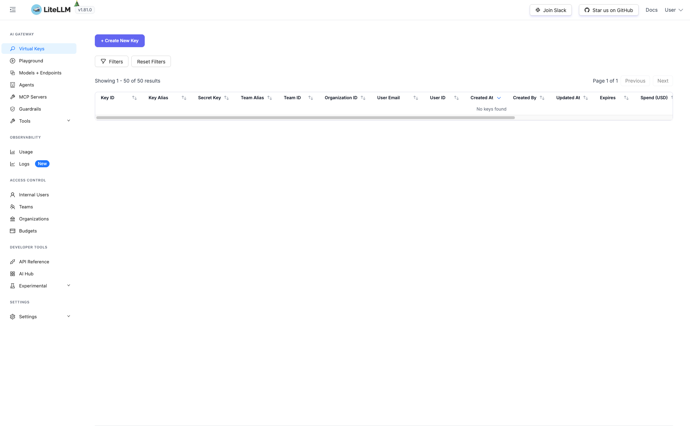
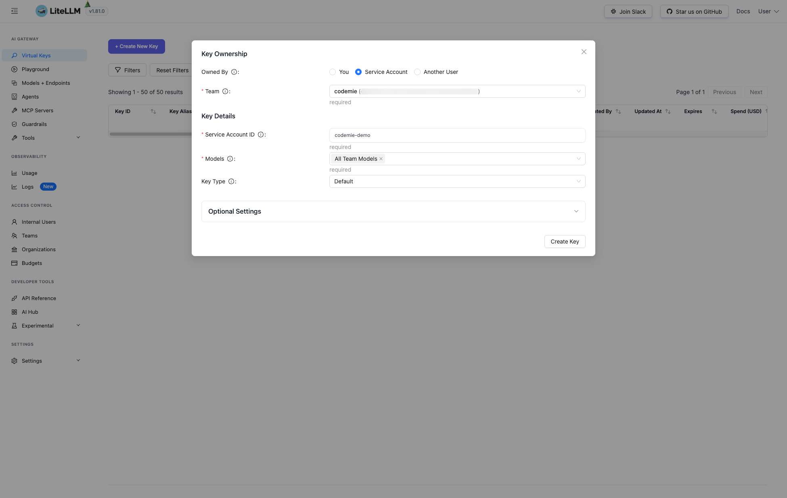
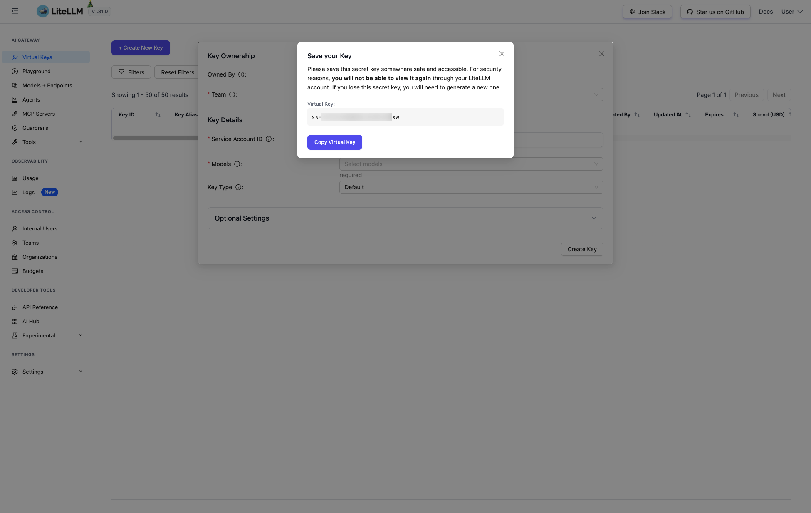
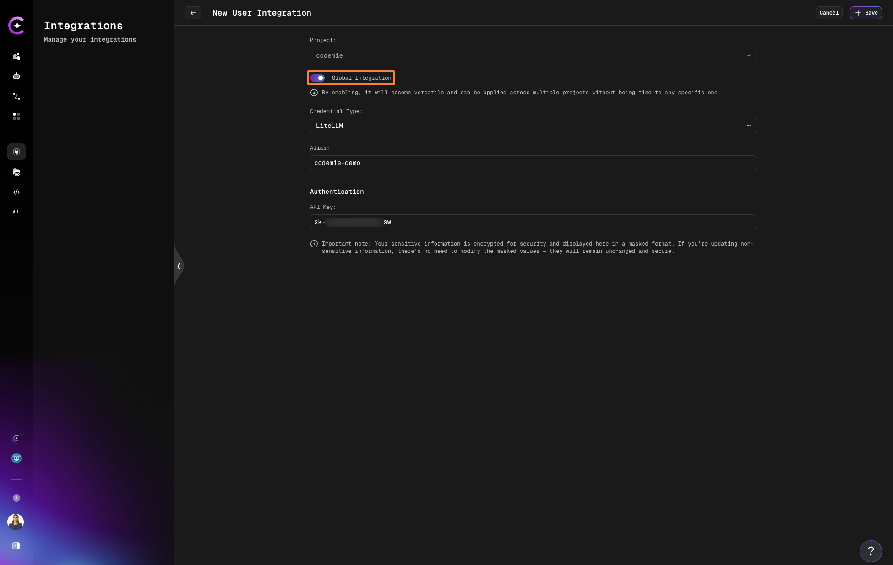
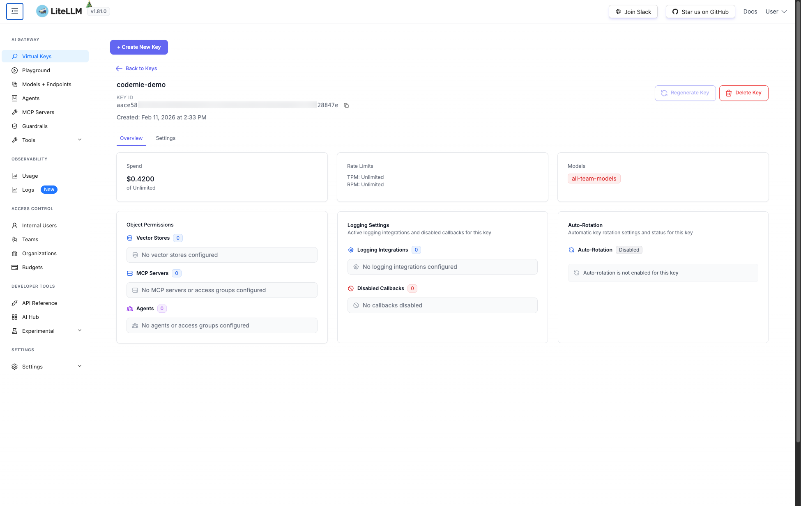

# LiteLLM

LiteLLM is a proxy that allows AI/Run CodeMie to connect to various LLM providers (AWS Bedrock, GCP Vertex AI, Azure OpenAI, etc.) through a unified API. This guide walks you through generating a LiteLLM Virtual Key and configuring the integration in AI/Run CodeMie.

## 1. Generate LiteLLM Virtual Key

1.1. Open your LiteLLM Dashboard and navigate to **Virtual Keys** in the sidebar. Click **+ Create New Key**:

1.2. Fill in the key parameters and click **Create Key**:

- **Owned By**: Service Account
- **Team**: Select your team (e.g., "codemie")
- **Service Account ID**: Specify a service account ID (e.g., "codemie-demo")
- **Models**: Select models the key should have access to (e.g., "All Team Models")
- **Key Type**: Default

1.3. Copy the generated Virtual Key from the dialog and store it securely:

:::warning
You will not be able to view this key again. Make sure to copy and save it before closing the dialog.
:::

## 2. Configure Integration in AI/Run CodeMie

2.1. In the AI/Run CodeMie main menu, click **Integrations**, select **User** or **Project** tab, and click **+ Create**.

2.2. Specify the integration parameters and click **Save**:

- **Project**: Select your AI/Run CodeMie project name.
- **Global Integration**: Toggle on to use across multiple projects. If disabled, the integration will only be available within the selected project, and assistants and workflows attached to other projects will not be able to use it.
- **Credential Type**: LiteLLM
- **Alias**: Enter integration name (e.g., "codemie-demo").
- **API Key**: Paste the Virtual Key copied in the previous step.

:::info
If you create this integration under the **Project** tab, the key will be available to the entire project by default, meaning all project members can use it.
:::

## 3. Verify Usage

After using the integration, you can open the LiteLLM Dashboard to verify that requests have been made and monitor usage, including spend and rate limits:

