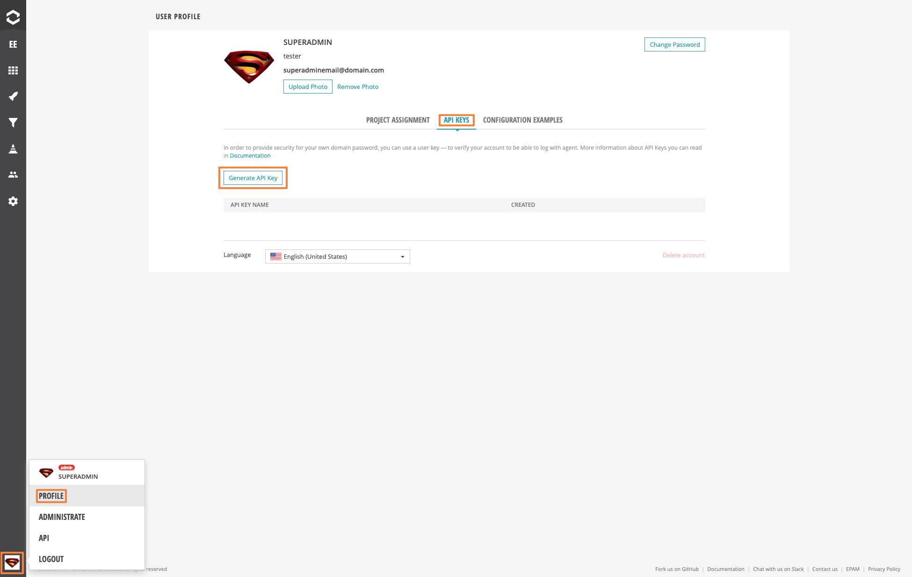
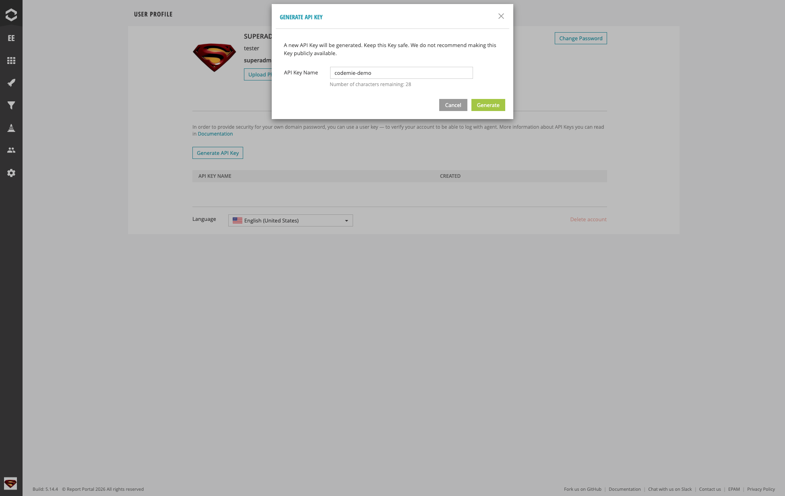
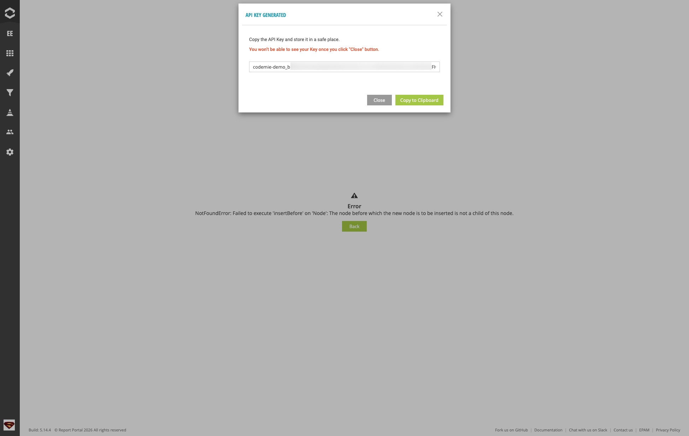
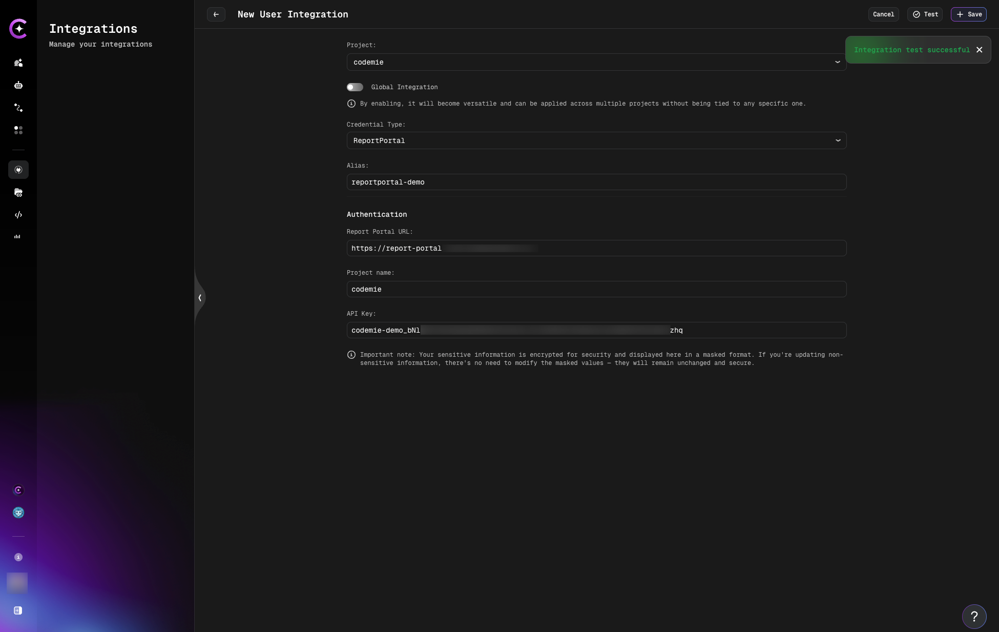
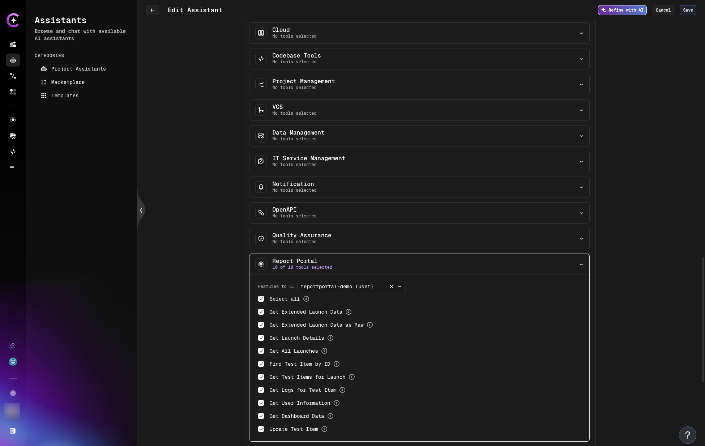
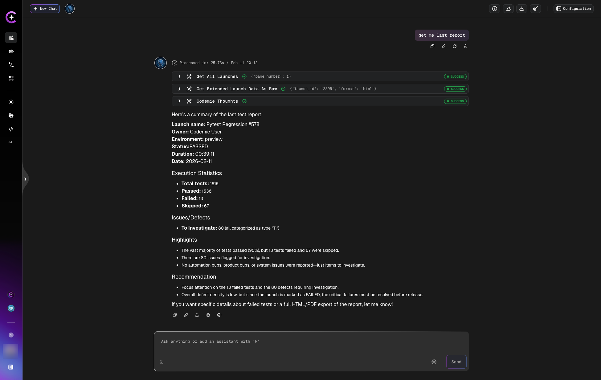

# ReportPortal

AI/Run CodeMie integrates with [ReportPortal](https://reportportal.io/) to provide AI-powered analysis of test execution results. This integration allows assistants to retrieve launch data, analyze test failures, and provide actionable recommendations for improving test quality.

## 1. Generate ReportPortal API Key

1.1. Log in to your ReportPortal instance. Click your user icon in the bottom-left corner and select **Profile**:

1.2. Navigate to the **API Keys** tab and click **Generate API Key**. Specify a key name (e.g., "codemie-demo") and click **Generate**:

1.3. Click **Copy to Clipboard** to copy the generated API Key and store it securely:

:::warning
You won't be able to see your Key once you click the "Close" button. Make sure to copy and save it before closing the dialog.
:::

## 2. Configure Integration in AI/Run CodeMie

2.1. In the AI/Run CodeMie main menu, click **Integrations**, select **User** or **Project** tab, and click **+ Create**.

2.2. Specify the integration parameters and click **+ Save**:

- **Project**: Select your AI/Run CodeMie project name.
- **Global Integration**: Toggle on to use across multiple projects. If disabled, the integration will only be available within the selected project, and assistants and workflows attached to other projects will not be able to use it.
- **Credential Type**: ReportPortal
- **Alias**: Enter integration name (e.g., "reportportal-demo").
- **Report Portal URL**: Enter the URL of your ReportPortal instance (e.g., `https://report-portal.example.com`).
- **Project name**: Enter the ReportPortal project name you want your assistant to analyze (e.g., "codemie").
- **API Key**: Paste the API Key copied in step 1.3.

:::tip
You can click the **Test** button to verify the connection before saving. You should see an "Integration test successful" notification if the parameters are correct.
:::

:::info
If you create this integration under the **Project** tab, the key will be available to the entire project by default, meaning all project members can use it.
:::

## 3. Create Assistant with ReportPortal Tool

3.1. Click **Explore Assistant**, then click **Create Assistant** or edit an existing one.

3.2. In the assistant settings, expand the **Report Portal** section under available tools and select your ReportPortal integration alias from the dropdown. The following operations will be available:

- **Get All Launches** — retrieve all test launches
- **Get Extended Launch Data** — get detailed launch information
- **Get Extended Launch Data as Raw** — get raw launch data
- **Get Launch Details** — retrieve specific launch details
- **Find Test Items by ID** — search for test items
- **Get Test Items for Launch** — list test items within a launch
- **Get Logs Per Test Item** — retrieve logs for specific tests
- **Get Test Attributes** — get test attributes
- **Get Dashboard Data** — retrieve dashboard information
- **Update Test Item** — update test item details

3.3. Click **Create** or **Save** to finalize your assistant.

## 4. Use Your Assistant

4.1. Select your assistant and start a conversation. You can interact with your ReportPortal data using natural language, for example:

- "Get me last report" — retrieve the most recent test launch summary
- "Show all failed tests from the latest launch"
- "What are the main issues in the last test run?"

The assistant will analyze the test results and provide a summary including execution statistics, failure details, and recommendations:

