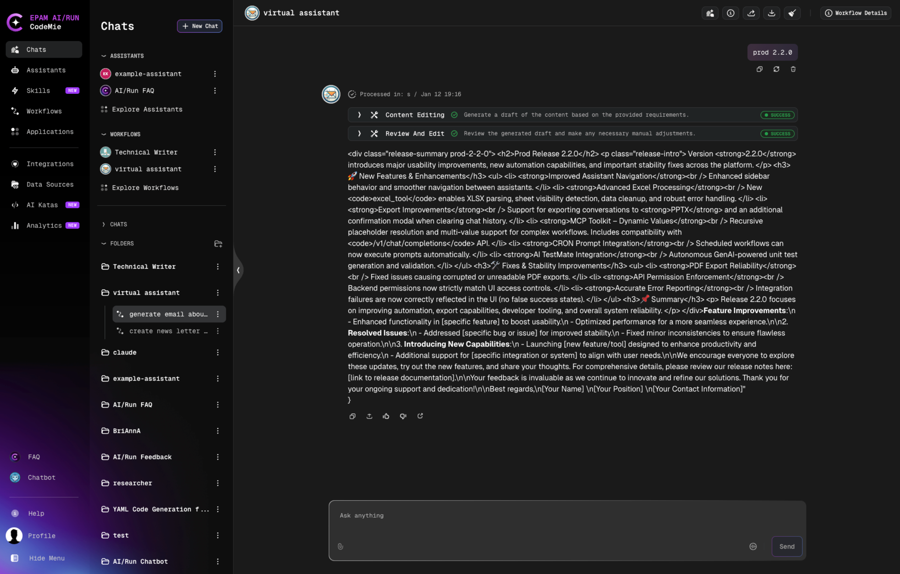
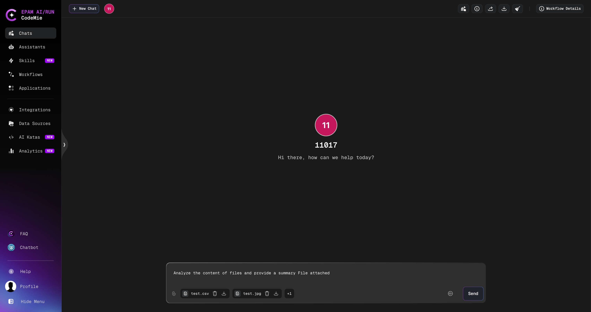
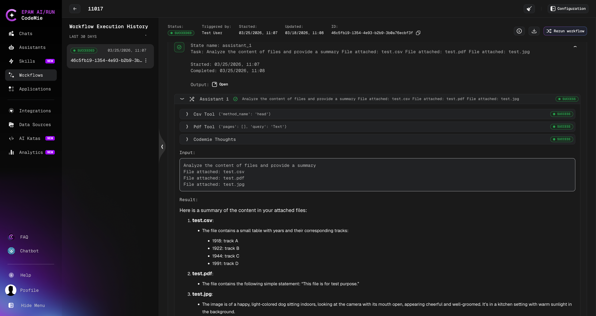

# Workflows Overview

AI/Run CodeMie allows you to design complex logic for interactions between assistants, enabling the creation of fully functional workflows. By executing a series of actions, users can create their own low-code pipelines to handle a wide variety of tasks.

## Accessing Workflows

Navigate to the **Workflows** tab in the left sidebar:


## Workflow Categories

Workflows are organized into three main categories:

| Category          | Description                                                         |
| ----------------- | ------------------------------------------------------------------- |
| **My Workflows**  | Your personal workflows that you own or manage                      |
| **All Workflows** | A complete list of workflows available for you to use               |
| **Templates**     | Ready-made templates for quickly creating and customizing workflows |


## Managing Workflows

### Workflow Actions

Click the **Actions** button on any workflow card to:

- Copy workflow link
- Clone the workflow
- Delete the workflow
- Edit workflow configuration
- View workflow details


To open the Workflow Details page, select **View Details** from the actions menu.


## Workflow Details Page

The Workflow Details page is the central hub for viewing, running, and managing a specific workflow.


### Header Actions

The following buttons are available in the page header:

| Button           | Description                                                                                                                  |
| ---------------- | ---------------------------------------------------------------------------------------------------------------------------- |
| **Edit**         | Opens the workflow editor to modify the workflow configuration. Only visible if you have edit permissions for this workflow. |
| **Start Chat**   | Creates a new chat session with this workflow as the active agent. You will be redirected to the Chat page.                  |
| **Run workflow** | Opens the **New Execution** dialog to start a workflow execution with a prompt.                                              |

### Tabs

The details page contains two tabs:

| Tab               | Description                                                                                                                   |
| ----------------- | ----------------------------------------------------------------------------------------------------------------------------- |
| **Executions**    | Lists all past and ongoing executions for this workflow. You can open any execution to view its progress, states, and output. |
| **Configuration** | Shows the workflow graph, YAML configuration, and sidebar with metadata such as Workflow ID and access links.                 |

### Configuration Tab

#### Workflow Graph

The visual graph displays all states (nodes) and their transitions (edges) in the workflow.

The graph toolbar at the bottom of the graph panel provides the following controls:

| Control          | Description                                                                                                                                     |
| ---------------- | ----------------------------------------------------------------------------------------------------------------------------------------------- |
| **+** (Zoom in)  | Increases the zoom level of the graph.                                                                                                          |
| **−** (Zoom out) | Decreases the zoom level of the graph.                                                                                                          |
| **Fit view**     | Automatically scales and repositions the graph so all nodes are visible within the current panel.                                               |
| **Download**     | Saves the current graph view as an image file.                                                                                                  |
| **Expand**       | Expands the graph panel to fill the entire viewport, hiding other page elements for a focused view. To exit, click **Collapse** or press `Esc`. |

:::tip Fullscreen graph view
Use the **Expand** button to view complex workflows in fullscreen mode — especially useful during demos or knowledge-sharing sessions.
:::

#### YAML Configuration

Below the graph, the full YAML configuration of the workflow is displayed in a read-only code block. Use the **Copy** button in the top-right corner of the code block to copy the YAML to your clipboard.

#### Sidebar

The right sidebar displays workflow metadata:

| Field                        | Description                                                                               |
| ---------------------------- | ----------------------------------------------------------------------------------------- |
| **Project**                  | The project this workflow belongs to.                                                     |
| **Workflow ID**              | The unique identifier of this workflow. Click the copy icon to copy it to your clipboard. |
| **Link to workflow details** | A direct URL to this Workflow Details page. Click the copy icon to copy the link.         |

## Starting Workflow in Chat Mode

Launch workflows within a chat interface, preserving conversational context and minimizing context switching. Your chat prompt serves as the initial input for the workflow.

1. Click the **Start Chat** button on the workflow card

   

2. Enter your prompt in the chat interface

   

3. The workflow executes with your message as the initial input

4. Monitor progress and view results in the chat

### Opening the Execution Page from Chat

Each workflow response message in chat mode includes an **Open execution page** icon in the message action bar. Click it to open the full workflow execution page for that specific message in a new tab — where you can review execution steps, states, and detailed output.

### Attaching Files in Chat Mode

When running a workflow in chat mode, you can attach up to **10 files** to your message.
**To attach files:**

1. In the chat input area, attach files using any of these methods:
   - Click the **paperclip** icon in the input toolbar to open a file picker
   - Drag and drop files directly into the chat window
2. Each uploaded file appears as a chip with options to preview, download, or remove it.
3. Send your message to start the workflow execution.



After execution completes, you can view the results in the **Workflow Execution History**:



**Supported file types and limits:**

| Parameter     | Value                               |
| ------------- | ----------------------------------- |
| Max files     | 10 per execution                    |
| Max file size | 100 MB per file                     |
| File formats  | CSV, PDF, JPEG, JPG, PNG, GIF, PPTX |

**How files are available in workflow steps:**

Each attached file is appended to the task description of every state:

```
File attached: filename.ext
```

The full list of file names is also accessible via the `{{file_names}}` context variable in YAML task templates or tool arguments.

:::tip Referencing a specific file
Mention a file by name (e.g., `@report.pdf`) to direct a step to focus on that specific file rather than processing all attached files.
:::

### Chat History

Workflow chat history works the same way as with regular assistants. You can always review your workflow conversations in the Chats tab that started in a chat mode, where you'll find:

- Recently used workflows
- Recently used assistants

## Starting Workflow in Execution Mode

The standard way to launch a workflow with a dedicated execution interface.

1. Click the **Start Execution** button on the workflow card:

   

2. Enter your prompt in the New Workflow Execution window:

   

3. Click **Create** to initiate the execution.

### Monitoring Execution

After starting an execution, you'll be redirected to the Workflow Execution page:


### Execution Controls

During execution, you can:

- **View Progress**: Monitor execution status in the **States** tab
- **Rerun**: Restart the workflow execution
- **Abort**: Stop a running execution


:::info
The abort button is only available while the workflow is actively executing.
:::


### Execution History

All workflow executions are saved in the execution history. Switch between past executions by clicking on them in the history panel:


